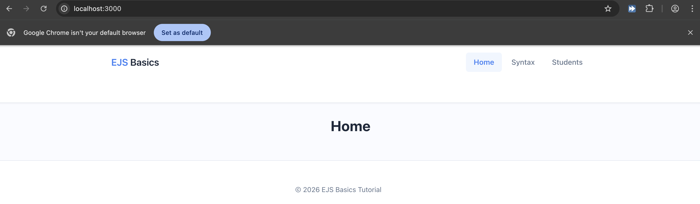
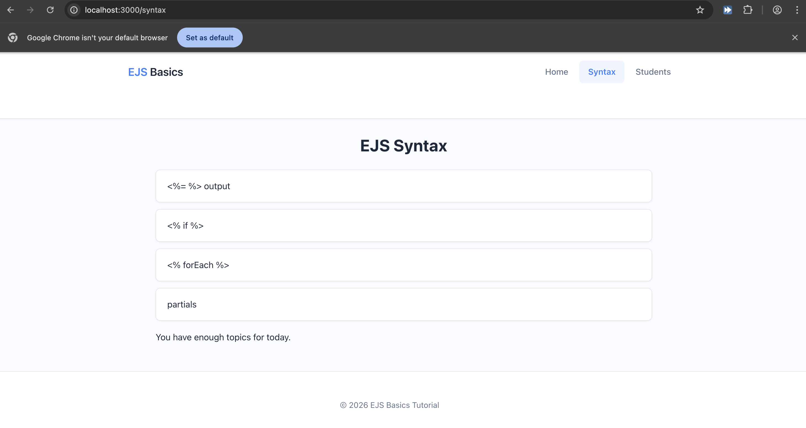
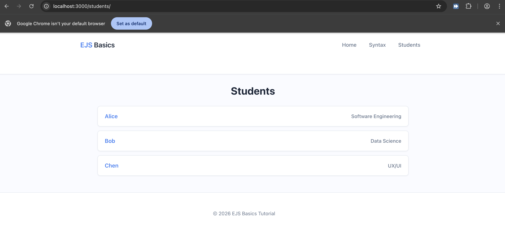
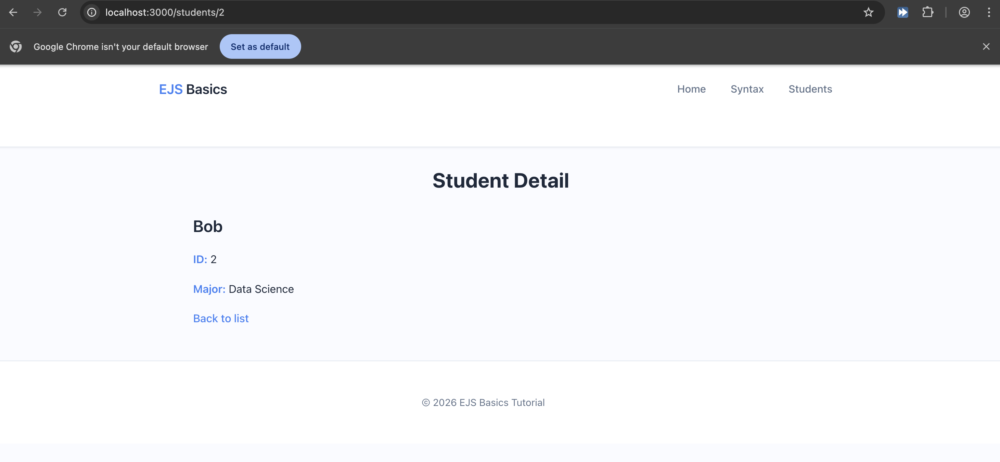
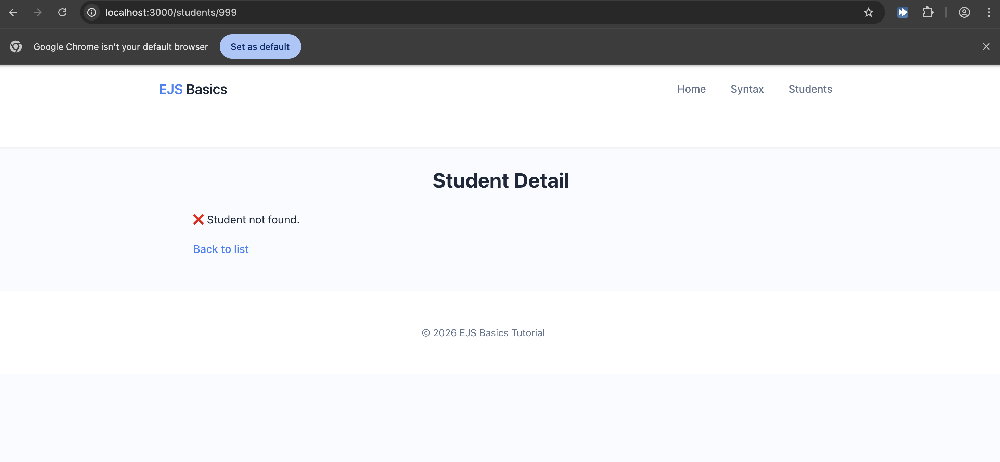

## LAB06 EJS
### Puri Sangnawakit 682115036
### Screenshots

### Q&A
1. In one sentence: What does res.render(view, data) do?
- res.render(view, data) It compiles an EJS template file using the provided data into a complete HTML string and sends it to the browser as a response.
2. What is the difference between <%= %> and <%- %>?
- Difference between <%= %> and <%- %> <%= %> outputs escaped text (safe; renders HTML tags as text), while <%- %> outputs raw HTML (renders the tags directly).
3. Where does Express look for EJS templates (folder path)?
- Where Express looks for templates By default, it looks in the ./views folder in your project root, but in your code, you customized it to look in ../views (one level up from your server file).
